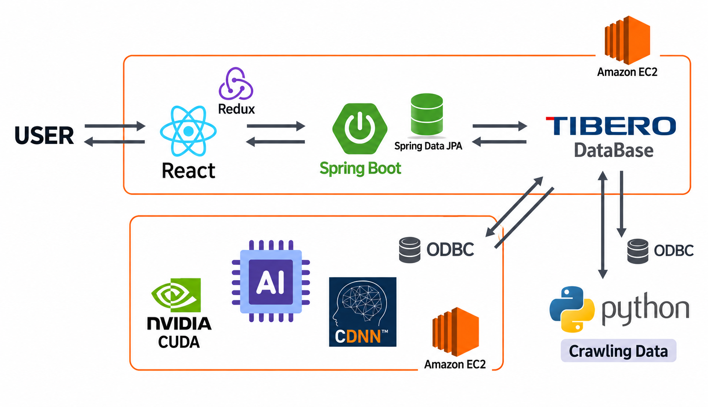

# 다잡아

**AI로 자기소개서를 분석해 크롤링으로 수집한 채용공고와 매칭하는 서비스**

**담당 역할**　프론트엔드 개발  
**기술**　React, JavaScript, Tailwind CSS, React Redux  
**GitHub**　[TABA-DaJobA/Front](https://github.com/TABA-DaJobA/Front)

## 시스템 구조

## 핵심 기능

- **채용공고 탐색**: 직군별 필터, 페이지네이션, 공고 상세 조회
- **자기소개서 관리**: 작성, 조회, 수정, 삭제, 글자 수 표시, 새 자기소개서 초안 저장과 복원
- **매칭 결과 확인**: 기업별 매칭 점수와 순위 시각화, 추천 공고 연결

### 사용자 경험 개선

#### 1. 채용공고 페이지네이션

**개선 배경**

초기에는 모든 채용공고를 한 페이지에 불러와 데이터 로딩에 시간이 걸렸습니다. 서비스를 사용해 본 사람들도 긴 목록에서 어디까지 확인했는지 알기 어렵다며, 페이지를 나누면 좋겠다는 의견을 주었습니다.

**개선 내용**

한 번에 불러오는 공고 수를 줄이고, 탐색 위치를 페이지 번호로 표시하면 두 가지 불편을 함께 줄일 수 있다고 생각했습니다. 서버 페이지네이션 API를 연동해 현재 페이지의 공고 20건만 요청하도록 변경했습니다. 페이지 번호는 10개 단위로 표시하고 현재 페이지를 강조했으며, 이전과 다음 버튼으로 이동할 수 있도록 구성했습니다.

**결과**

그 결과 전체 공고를 한 번에 불러오던 방식에서 페이지당 최대 20건씩 조회하는 방식으로 바뀌었습니다. 사용자는 긴 목록을 계속 내려보는 대신, 현재 페이지를 확인하면서 공고를 나눠 탐색할 수 있게 됐습니다.

---

#### 2. AI 분석 대기 상태 안내

**개선 배경**

초기에는 AI 분석을 기다리는 동안 분석 중이라는 문구만 표시했습니다. 사용자들은 문구만으로는 실제로 분석이 진행 중인지, 화면이 멈춘 것인지 구분하기 어렵다는 의견을 주었습니다.

**개선 내용**

문구에 움직이는 표시를 더하면 결과를 기다리는 상태를 더 명확하게 전달할 수 있다고 생각했습니다. 안내 문구 옆에 CSS 회전 애니메이션을 적용한 로딩 스피너를 추가했습니다.

**결과**

수정 후에는 결과가 표시되기 전까지 안내 문구와 회전하는 스피너가 함께 나타납니다. 정적인 문구만 보여주던 화면에 시각적인 대기 표시를 더했습니다.

---

#### 3. 자기소개서 초안 저장과 복원

**개선 배경**

새 자기소개서 작성 화면을 확인하면서, 저장 전에 새로고침하거나 다른 화면으로 이동하면 입력 내용이 사라지는 문제를 발견했습니다. 작성에 시간이 걸리는 자기소개서의 특성상, 내용을 잃으면 처음부터 다시 써야 하는 불편이 크겠다고 생각했습니다.

**개선 내용**

사용자가 저장 버튼을 누르지 않아도 초안을 남기고, 다시 방문했을 때 이어서 쓸 수 있도록 개선했습니다. 입력을 멈춘 뒤 0.8초가 지나면 제목과 내용, 희망 직군을 사용자별로 브라우저에 저장하고, 그 전에 화면을 나가도 마지막 입력을 저장하도록 처리했습니다. 재방문 시에는 초안 복원 여부를 선택할 수 있으며, 서버 저장에 성공하면 초안을 삭제하도록 했습니다.

**결과**

그 결과 같은 브라우저에서 작성 화면을 다시 열면 임시 저장한 내용을 불러와 이어서 작성할 수 있게 됐습니다. 서버 저장에 실패해도 입력 내용을 유지한 채 재시도할 수 있습니다. 자동 테스트로 화면을 떠나기 직전의 입력 보존과 재방문 시 복원, 사용자별 초안 분리, 저장 실패 시 내용 유지를 확인했습니다.
