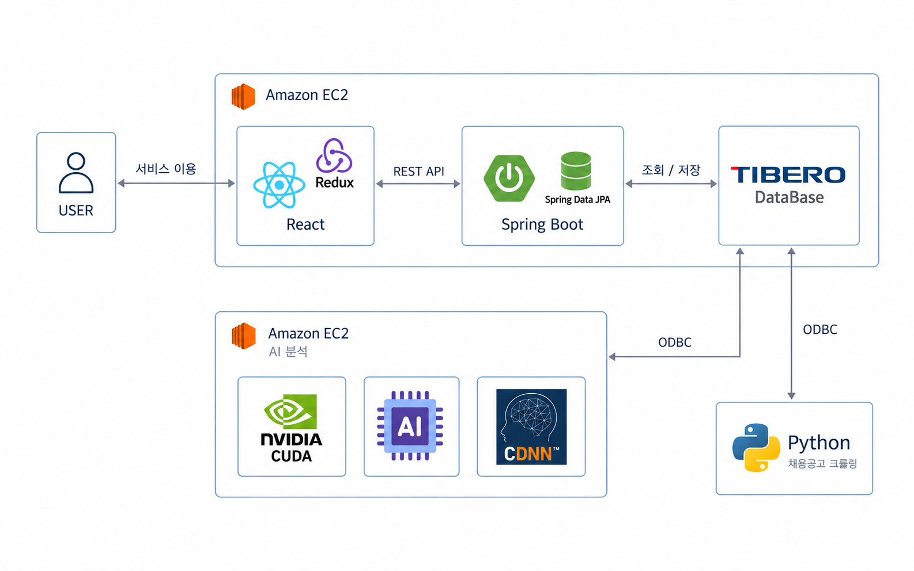
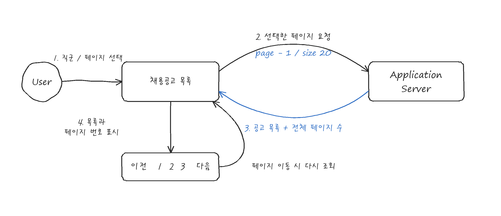
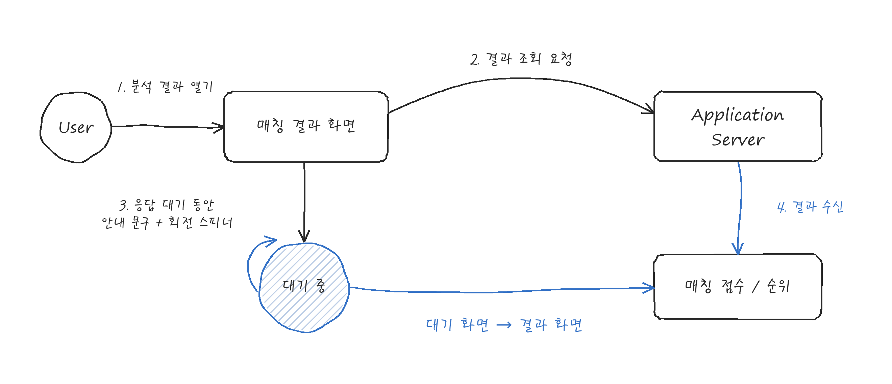
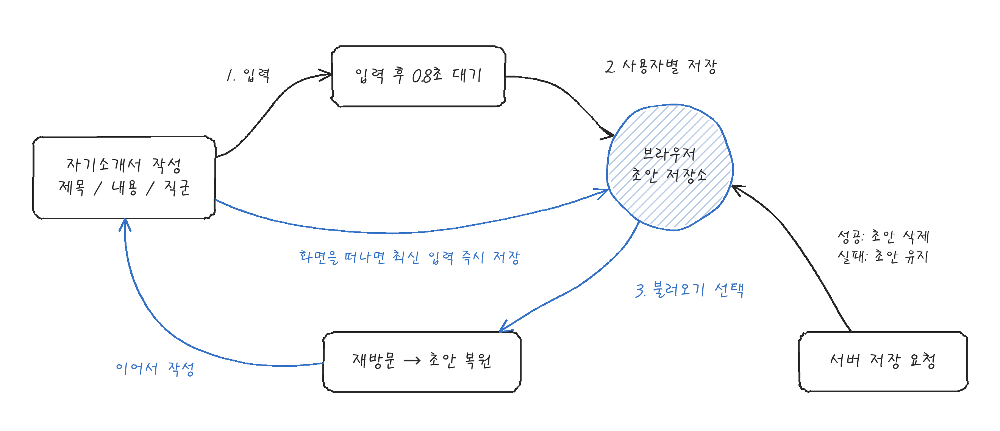

# 다잡아

**AI로 자기소개서를 분석해 크롤링으로 수집한 채용공고와 매칭하는 서비스**

- 담당 역할: 프론트엔드
- 기술: JavaScript, React, Redux Toolkit, React Redux, Redux Persist, Tailwind CSS
- GitHub: [TABA-DaJobA/Front](https://github.com/TABA-DaJobA/Front)

## 시스템 구조

## 핵심 기능

- **채용공고 탐색**: 직군별 필터, 페이지네이션, 공고 상세 조회
- **자기소개서 관리**: 작성, 조회, 수정, 삭제, 글자 수 표시, 새 자기소개서 초안 저장과 복원
- **매칭 결과 확인**: 기업별 매칭 점수와 순위 시각화, 추천 공고 연결

## 사용자 경험 개선

### 1. 서버 페이지네이션으로 채용공고 조회 범위와 탐색 방식 개선

#### 전체적인 아키텍처

#### 개선 배경

- 초기에는 모든 채용공고를 한 페이지에 불러와 로딩에 시간이 걸리고, 긴 목록에서 어디까지 확인했는지 알기 어렵다는 사용자 의견 확인.
- 현재 화면에서 필요한 범위를 구분하지 않고 전체 목록을 불러오는 방식이어서, 조회 범위를 나누고 탐색 위치를 표시할 필요가 있었음.

#### 개선 과정

- 한 번에 요청하는 공고 수를 줄이고 현재 탐색 위치를 보여주기 위해 서버 페이지네이션 API 연동. 페이지당 최대 20건을 요청하도록 구성.
- 화면과 서버의 페이지 번호 기준을 맞춰 선택한 페이지의 공고를 조회하고, 서버에서 받은 전체 페이지 수를 탐색 버튼에 반영.
- 페이지 번호를 10개 단위로 표시하고 현재 페이지를 강조. 이전과 다음 버튼으로 페이지를 이동할 때 번호 표시 구간도 함께 변경.

#### 테스트

- 페이지당 20건을 요청하는 조건과 화면의 페이지 번호가 API 요청에 맞게 변환되는지 확인.
- 응답의 공고 목록과 전체 페이지 수가 화면에 반영되는 흐름 확인.
- 첫 페이지에서는 이전 버튼을, 마지막 페이지에서는 다음 버튼을 비활성화하는 조건과 10페이지 구간 전환 로직 확인.

#### 결과

- 전체 공고를 한 번에 요청하던 방식에서 페이지당 최대 20건을 요청하는 구조로 변경.
- 사용자가 현재 페이지를 확인하고, 목록을 나누어 탐색할 수 있도록 구성.

### 2. 분석 대기 화면에 스피너를 추가해 대기 상태 안내

#### 전체적인 아키텍처

#### 개선 배경

- 초기에는 분석을 기다리는 동안 정적인 문구만 표시하여, 사용자가 결과를 기다리는 상황인지 화면이 멈춘 것인지 구분하기 어렵다는 의견 확인.
- 비동기 결과 조회 중 대기 상태를 시각적으로 전달하는 표시가 부족했음.

#### 개선 과정

- 정적인 문구만으로는 대기 상태를 전달하기 어렵다고 판단. 안내 문구 옆에 CSS 회전 애니메이션을 적용한 원형 스피너 추가.
- 서버에서 매칭 결과를 받으면 대기 안내 대신 결과 화면을 표시하도록 구성.

#### 테스트

- 대기 안내 문구와 함께 스피너에 회전 애니메이션이 적용되는지 확인.
- 매칭 결과 데이터가 들어오면 대기 화면에서 결과 화면으로 전환되는 흐름 확인.

#### 결과

- 정적인 안내 문구에 회전하는 스피너를 추가해 결과를 기다리는 상황을 시각적으로 안내.

### 3. 자기소개서 초안 자동 저장과 복원으로 작성 내용 유실 방지

#### 전체적인 아키텍처

#### 개선 배경

- 새 자기소개서 작성 중 저장 전에 새로고침하거나 다른 화면으로 이동하면 입력 내용이 사라지는 문제 확인.
- 입력값을 화면 상태에만 보관하면 화면이 해제된 뒤 복원할 수 없음.
- 지연 저장만 적용하면 저장 대기 시간 안에 화면을 떠날 때 마지막 입력이 누락될 수 있음. 계정 변경이나 늦게 도착한 서버 응답이 초안에 영향을 주는 경우도 고려.

#### 개선 과정

- 작성 화면에 다시 방문해도 내용을 이어 쓸 수 있도록 브라우저 저장소에 초안을 보관. 입력할 때마다 저장하지 않고, 입력을 멈춘 뒤 0.8초가 지나면 제목과 내용, 희망 직군을 저장하도록 구현.
- 저장 대기 중 화면을 떠나도 마지막 입력이 빠지지 않도록, 새로고침이나 화면 이동 시 저장하지 못한 최신 내용을 즉시 저장.
- 다른 계정의 작성 내용이 섞이지 않도록 사용자별로 초안을 구분하고, 계정이 바뀌면 작성 화면의 입력 상태도 초기화. 재방문 시 초안을 불러오거나 삭제하도록 선택권 제공.
- 서버 저장 성공 시 초안을 삭제하고, 실패 시 입력 내용을 유지해 재시도 가능하도록 구현. 저장 중 중복 제출 차단.
- 화면을 떠난 뒤 도착한 서버 응답이 새 초안을 삭제하지 않도록 처리. 서버 저장 성공 후 초안 삭제만 실패한 경우에는 재제출을 막고 저장된 글로 이동할 수 있도록 구성.

#### 테스트

- Jest와 React Testing Library로 입력 지연 저장과 제목, 내용, 희망 직군의 복원 여부를 검증. 저장 대기 중 화면을 떠나도 마지막 입력이 보존되는지 확인.
- 사용자별 초안 분리, 초안 삭제, 서버 저장 실패 후 재시도와 중복 제출 차단 검증.
- 저장소 쓰기 실패, 손상된 저장 데이터, 이탈 후 늦은 서버 응답, 서버 저장 성공 후 초안 삭제 실패 검증.
- 자동 테스트 11개 모두 통과.

#### 결과

- 같은 브라우저에서 새 자기소개서 작성 화면을 다시 열면 저장된 초안을 선택해 이어서 작성 가능.
- 저장 대기 중 화면을 떠나는 경우에도 마지막 입력을 보존하도록 처리하고, 서버 저장 실패 시 입력 내용과 초안을 유지.
- 사용자 변경과 늦은 서버 응답에 따른 초안 간섭을 방지하는 동작을 자동 테스트로 확인.
